# 2023-DB-Project 

数据库课程项目作业-智慧安防小区系统  Intelligent-Security-Community

前端Vue3,后端flask+mysql

基础前端模型参考的是Geeker-Admin https://github.com/HalseySpicy/Geeker-Admin 


## 一、使用说明

1、git clone https://github.com/qbdl/2023-DB-Project 

2、基础配置

- 前端（要安装一会会）:

  终端依次输入:

  ```powershell
  cd .\FrontEnd\
  npm install
  npm run dev
  ```

  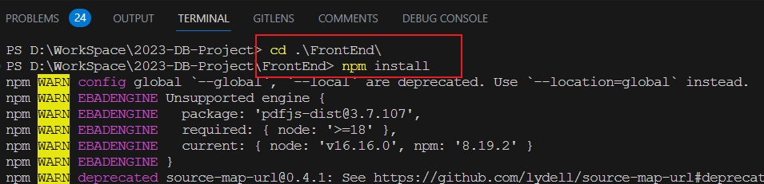

- 后端: 

  ```powershell
  cd .\BackEnd
  python main.py
  ```

  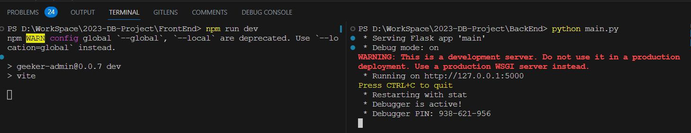

- 数据库:

  依次将下面的sql文件执行来初始化数据库表:

  ```
  initTable.sql
  setTrigger.sql
  insertData.sql
  ```

  p.s  如果要尝试人脸识别，要将FrontEnd/public/assets/labeled-images/Jack目录下的图像换成你要识别的人脸图像,我就不放上自己的大头像了😆
  
  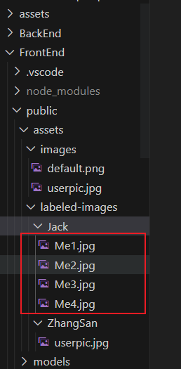

## 二、实现内容

- 前后端分离+数据库
- 数据库加入触发器来保证数据一致性
- 人脸识别（基于前端数据）
- flask 蓝图多文件
- 数据表间建立外键等约束
- 登录，个人信息等走自己的后端而非mock端


## 三、效果预览

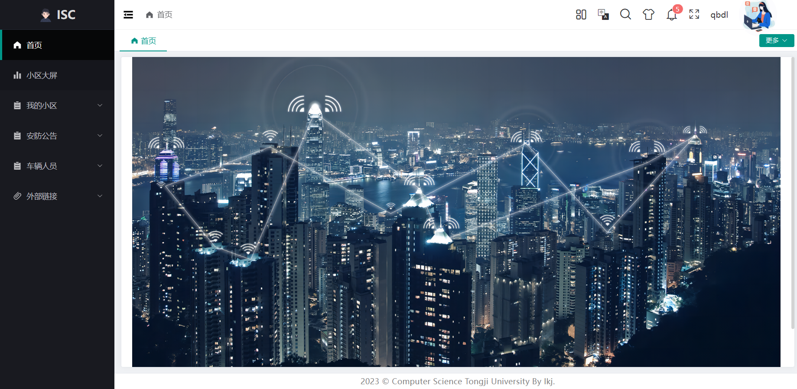

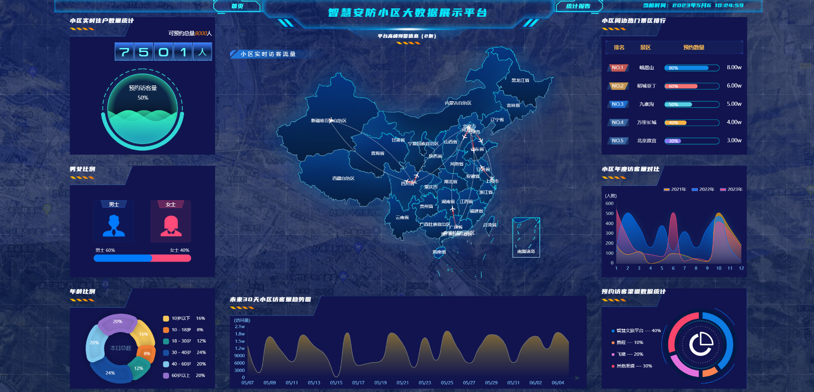

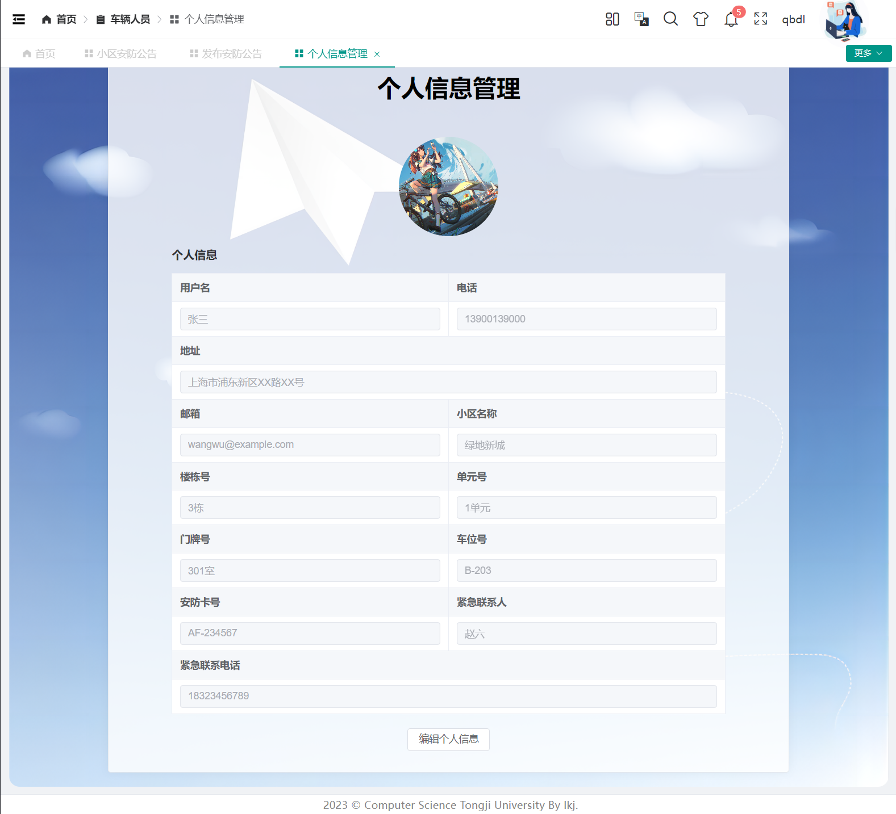

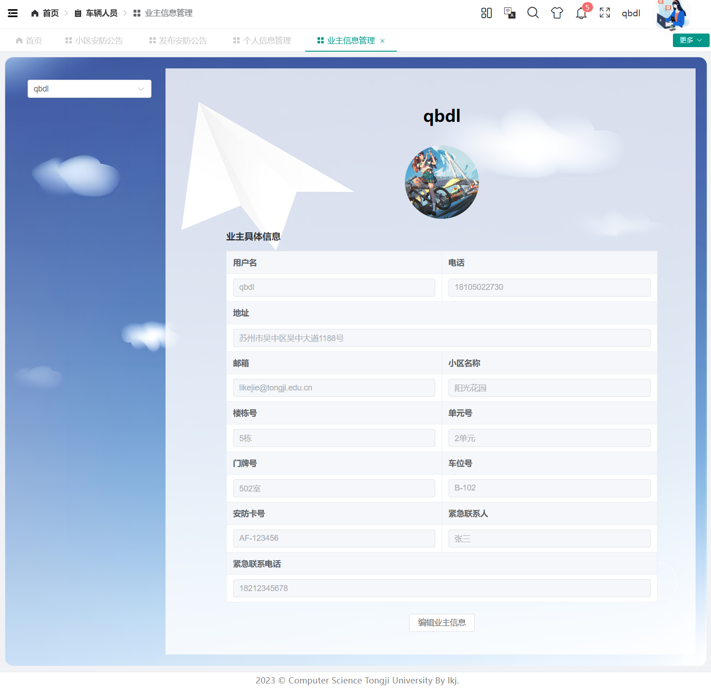

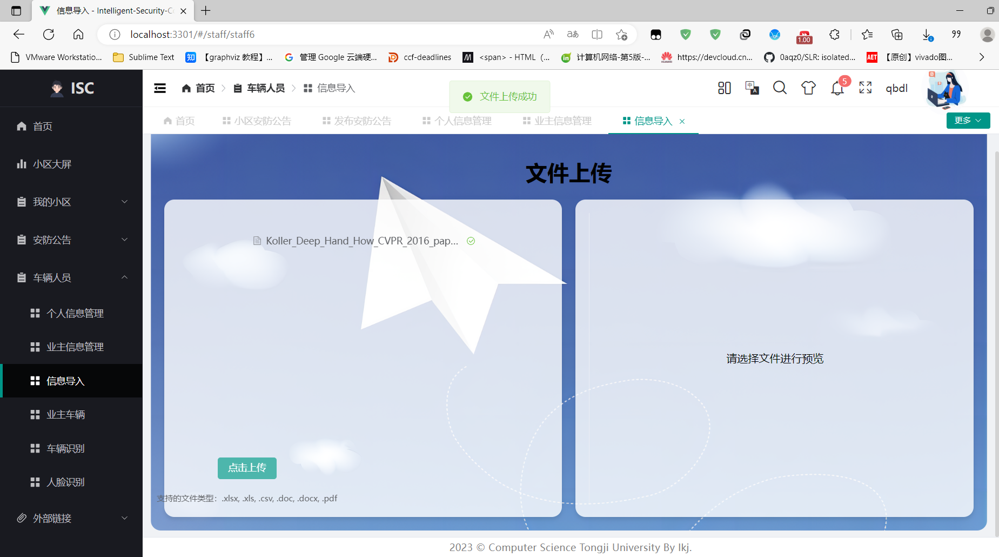

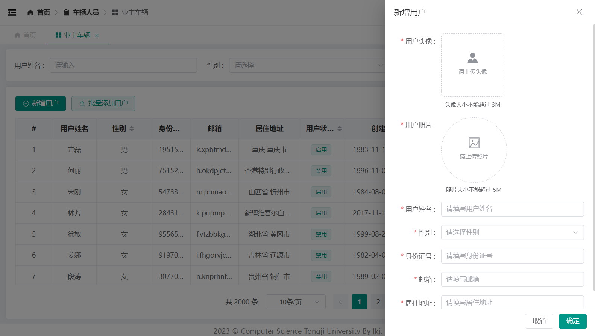

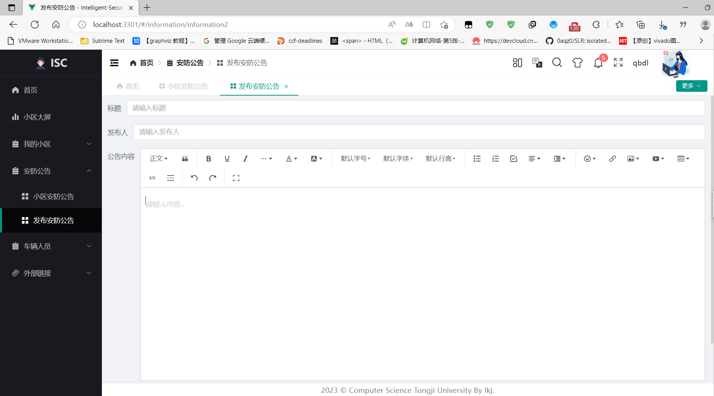

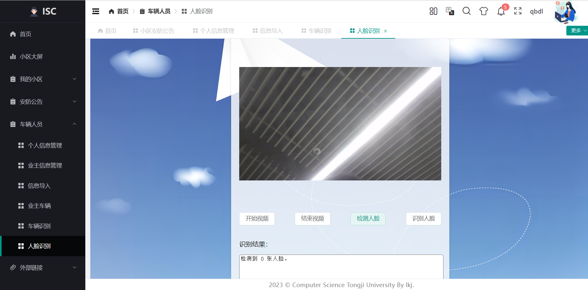

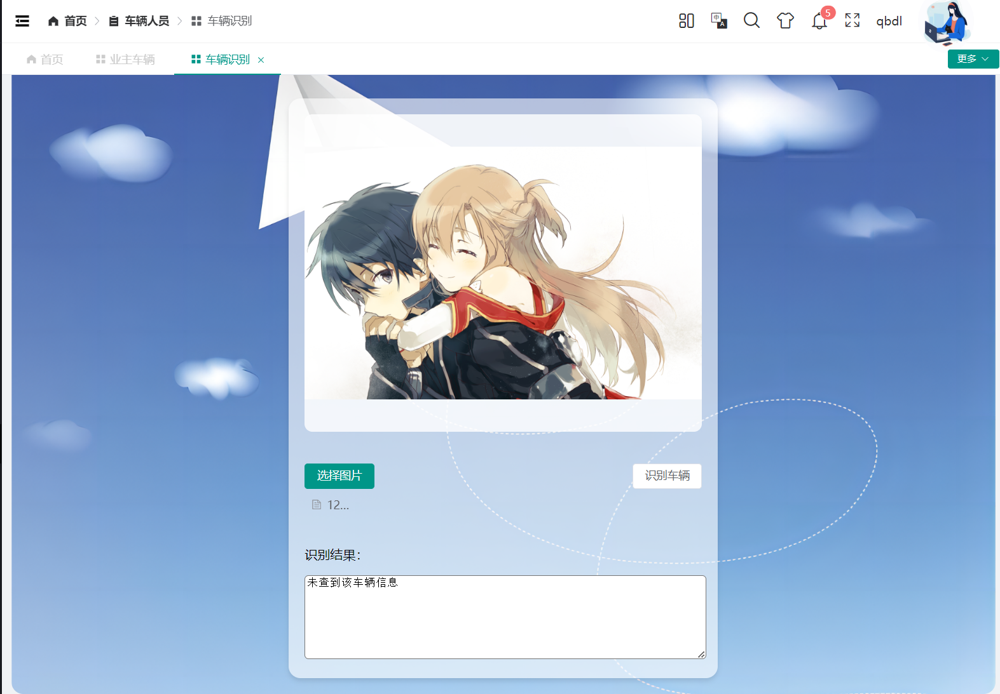


## 四、其他

- 如果想要继续开发的话，可以修改2023-DB-Project\FrontEnd\src\assets\json\dynamicRouter.json下的文件，这里面是不同的路由与页面（就是界面左边菜单显示的那些内容）
- mock数据来源修改的话在vite.config.js里server->proxy->target

- 一些没实现的功能：
  - 考虑前端用户在interface里封装自己的类并导出，模仿使用方便赋值与debug
  - 文件预览
  - 图像更改
  - 人脸数据传到后端，从后端读文件来识别
  - 增加一个函数获取当前用户ID等😆
