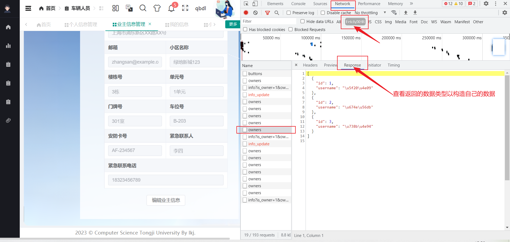
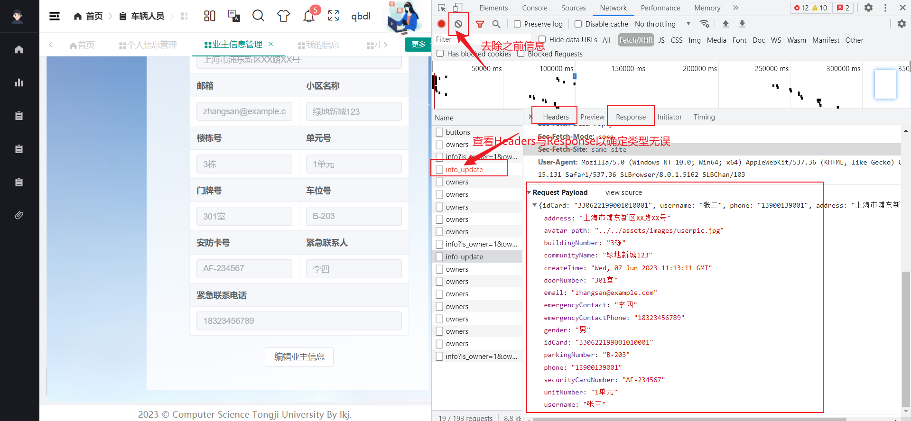
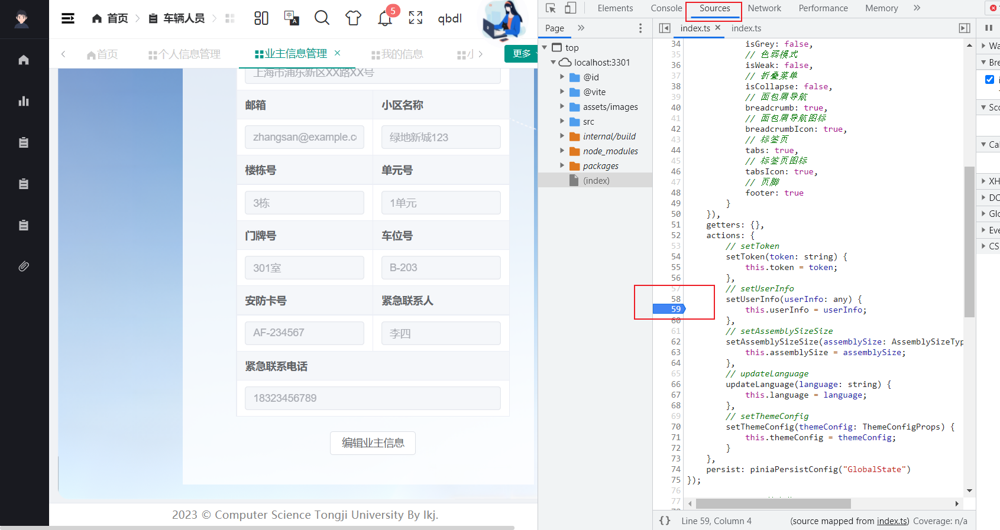
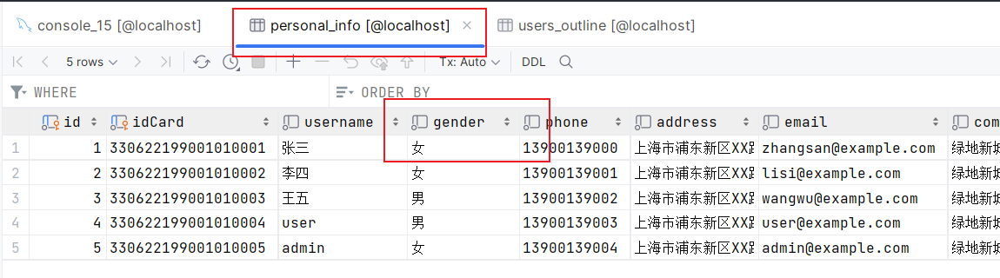
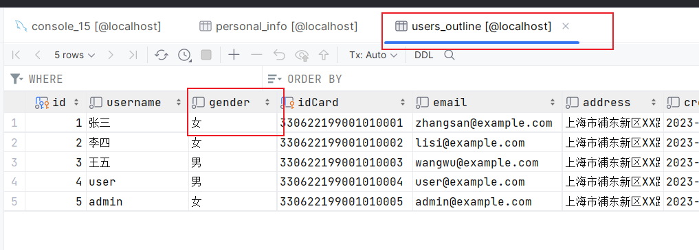

# 数据库开发学习记录

### 1、浏览器上debug与找数据

F12或右键检查，选择network，可以选中Fetch/XHR进行筛选，得到下面的内容

#### 查看Response:



#### 查看Header:



#### 打断点：

进入source,直接点击代码行即可打上断点（但这次感觉没什么用）




#### 在前端代码里使用console.log()/console.dir()


### 2、后端Flask蓝图（blueprint)

用途：将原来的单个后端代码文件拆分成多个蓝图文件

过程：

1、首先，创建一个**文件夹 routes**（也可以取别的名字）来存放你的蓝图文件。这个文件夹的层级结构应该像下面这样：

```
app.py
routes/
    __init__.py
    auth.py
    info.py
```

2、然后，在**__ init__.py**文件中引入所有的蓝图并在app中注册它们：

```python
# routes/__init__.py

from flask import Flask
from .auth import auth_blueprint # . 表示同级目录
from .info import info_blueprint

def register_blueprints(app: Flask):
    app.register_blueprint(auth_blueprint, url_prefix='') #真正路由=url_prefix+内部写的路由路径
    app.register_blueprint(info_blueprint)
    # 将你创建的蓝图注册到 Flask 应用中。只有注册后，蓝图中定义的路由和视图函数才能被 Flask 应用识别和使用。url_prefix 参数是一个可选的参数，它可以为蓝图中的所有路由提供一个统一的 URL 前缀。
```

3、在**每个蓝图的文件**中，将对应的函数和路由添加到蓝图对象中。例如，在auth.py中：

```python
# routes/auth.py

from flask import Blueprint, json

auth_blueprint = Blueprint('auth', __name__)  # 创建一个名为 'auth' 的蓝图!!!

@auth_blueprint.route('/login', methods=['POST'])
def login():
    info = {"code": 200, "data": {"access_token": "bqddxxwqmfncffacvbpkuxvwvqrhln"}, "msg": "成功"}
    return json.dumps(info)

@auth_blueprint.route('/logout', methods=['POST'])
def logout():
    info = {"code": 200, "msg": "成功"}
    return json.dumps(info)

```

4、然后，再根据这种方式创建剩下的蓝图文件。你的**主文件app.py**应该像这样：

```python
from flask import Flask
from flask_cors import CORS
from werkzeug.utils import secure_filename
from routes import register_blueprints #使用蓝图blueprint改变的地方

app = Flask(__name__)
CORS(app, resources={r'/*': {'origins': '*'}}, supports_credentials=True)

register_blueprints(app) #使用蓝图blueprint改变的地方

if __name__ == '__main__':
    app.run(debug=True)
```


Tips: g , current_app都是flask里全局的内容，可以通过from flask import g,current_app导入


### 3、数据库触发器-保证数据一致性

#### 目的：同步对表的操作

```mysql
-- Trigger for personal_info
    -- notes : 插入personal_info表内容后 同步插入 users_outline
DELIMITER //
CREATE TRIGGER personal_info_after_insert
AFTER INSERT ON personal_info
FOR EACH ROW
BEGIN
    INSERT INTO users_outline(id, username, gender, idCard, email, address, createTime, status, avatar_path)
    VALUES (NEW.id, NEW.username, NEW.gender, NEW.idCard, NEW.email, NEW.address, NEW.createTime, 1, NEW.avatar_path);
END //
DELIMITER ;

    -- notes : 更新personal_info表内容后 同步更新 users_outline
DELIMITER //
CREATE TRIGGER personal_info_after_update
AFTER UPDATE ON personal_info
FOR EACH ROW
BEGIN
    UPDATE users_outline
    SET username = NEW.username, gender = NEW.gender, idCard = NEW.idCard, email = NEW.email, address = NEW.address, createTime = NEW.createTime, avatar_path = NEW.avatar_path
    WHERE id = OLD.id;
END //
DELIMITER ;

    -- notes : 删除personal_info表内容后 同步删除 users_outline
DELIMITER //
CREATE TRIGGER personal_info_after_delete
AFTER DELETE ON personal_info
FOR EACH ROW
BEGIN
    DELETE FROM users_outline
    WHERE id = OLD.id;
END //
DELIMITER ;

-- DELIMITER ;
```

#### 效果：

一张表数据更改，另一张表数据同步修改




